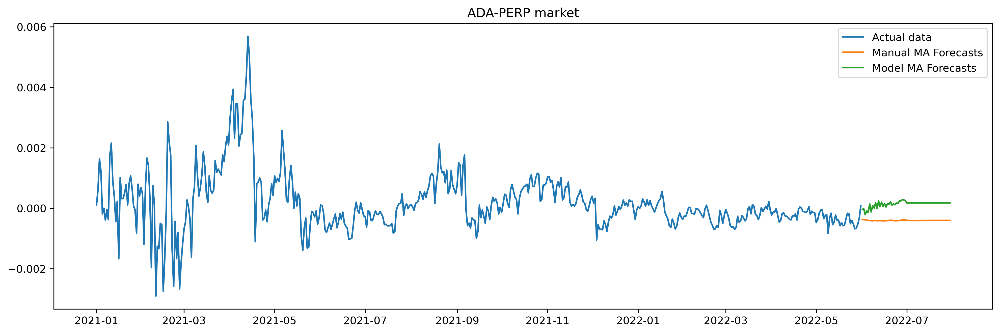

Let us start with importing the required packages and setting up the working directory.


```python
!pip install pmdarima
import ccxt
import pandas as pd
import numpy as np
import matplotlib.pyplot as plt
import os
import datetime as datetime
import warnings
from pmdarima.arima.utils import ndiffs
from statsmodels.tsa.arima.model import ARIMA
from itertools import islice
warnings.filterwarnings('ignore')
os.chdir(r'C:\Users\madha\My Drive\Desktop\Python\ValuedVA_task')
```

    Defaulting to user installation because normal site-packages is not writeable
    Requirement already satisfied: pmdarima in c:\users\madha\appdata\roaming\python\python39\site-packages (1.8.5)
    Requirement already satisfied: numpy>=1.19.3 in c:\programdata\anaconda3\lib\site-packages (from pmdarima) (1.21.5)
    Requirement already satisfied: Cython!=0.29.18,>=0.29 in c:\programdata\anaconda3\lib\site-packages (from pmdarima) (0.29.28)
    Requirement already satisfied: scipy>=1.3.2 in c:\programdata\anaconda3\lib\site-packages (from pmdarima) (1.7.3)
    Requirement already satisfied: urllib3 in c:\programdata\anaconda3\lib\site-packages (from pmdarima) (1.26.9)
    Requirement already satisfied: statsmodels!=0.12.0,>=0.11 in c:\programdata\anaconda3\lib\site-packages (from pmdarima) (0.13.2)
    Requirement already satisfied: setuptools!=50.0.0,>=38.6.0 in c:\programdata\anaconda3\lib\site-packages (from pmdarima) (61.2.0)
    Requirement already satisfied: pandas>=0.19 in c:\programdata\anaconda3\lib\site-packages (from pmdarima) (1.4.2)
    Requirement already satisfied: scikit-learn>=0.22 in c:\programdata\anaconda3\lib\site-packages (from pmdarima) (1.0.2)
    Requirement already satisfied: joblib>=0.11 in c:\programdata\anaconda3\lib\site-packages (from pmdarima) (1.1.0)
    Requirement already satisfied: python-dateutil>=2.8.1 in c:\programdata\anaconda3\lib\site-packages (from pandas>=0.19->pmdarima) (2.8.2)
    Requirement already satisfied: pytz>=2020.1 in c:\programdata\anaconda3\lib\site-packages (from pandas>=0.19->pmdarima) (2021.3)
    Requirement already satisfied: six>=1.5 in c:\programdata\anaconda3\lib\site-packages (from python-dateutil>=2.8.1->pandas>=0.19->pmdarima) (1.16.0)
    Requirement already satisfied: threadpoolctl>=2.0.0 in c:\programdata\anaconda3\lib\site-packages (from scikit-learn>=0.22->pmdarima) (2.2.0)
    Requirement already satisfied: patsy>=0.5.2 in c:\programdata\anaconda3\lib\site-packages (from statsmodels!=0.12.0,>=0.11->pmdarima) (0.5.2)
    Requirement already satisfied: packaging>=21.3 in c:\programdata\anaconda3\lib\site-packages (from statsmodels!=0.12.0,>=0.11->pmdarima) (21.3)
    Requirement already satisfied: pyparsing!=3.0.5,>=2.0.2 in c:\programdata\anaconda3\lib\site-packages (from packaging>=21.3->statsmodels!=0.12.0,>=0.11->pmdarima) (3.0.4)
    

Let's create an instance of the exchange and get the funding rates using the function provided.


```python
exchange=ccxt.ftx()
rates=exchange.publicGetFundingRates()
content=list(islice(rates.items(), 2))
display(content[1][1][:5])
```


    [{'future': 'ICP-PERP',
      'rate': '-0.00001',
      'time': '2022-06-11T08:00:00+00:00'},
     {'future': 'NEO-PERP', 'rate': '4e-6', 'time': '2022-06-11T08:00:00+00:00'},
     {'future': 'XMR-PERP',
      'rate': '-0.000015',
      'time': '2022-06-11T08:00:00+00:00'},
     {'future': 'ALICE-PERP',
      'rate': '-0.000018',
      'time': '2022-06-11T08:00:00+00:00'},
     {'future': 'ONT-PERP',
      'rate': '-0.00003',
      'time': '2022-06-11T08:00:00+00:00'}]


Since rates is a dictionary of dictionaries, where the sub-dictionary contains future name, rate and time as keys, let's extract the data in a dataframe with columns 'Market', 'Funding_rate' and 'Time'and then do some cleaning.


```python
df=pd.DataFrame(rates)
dicti={'Market':[], 'Funding_rate':[], 'Time':[]}
for i in range(len(df)):
    dicti['Market'].append(df['result'][i]['future'])
    dicti['Funding_rate'].append(df['result'][i]['rate'])
    dicti['Time'].append(df['result'][i]['time'])
    

data=pd.DataFrame(dicti)
data = data.astype({'Market': str, 'Funding_rate': float})
data['Corrected_Date']=data['Time'].apply(lambda x:  datetime.datetime.strptime(x[:10]+x[11:13], '%Y-%m-%d%H'))
data=data[['Corrected_Date', 'Market', 'Funding_rate']]
data=data.sort_values(['Corrected_Date', 'Market'])
data.reset_index(inplace = True, drop = True)
display(data.shape)
display(data.head())
```


    (500, 3)


<div>
<style scoped>
    .dataframe tbody tr th:only-of-type {
        vertical-align: middle;
    }

    .dataframe tbody tr th {
        vertical-align: top;
    }

    .dataframe thead th {
        text-align: right;
    }
</style>
<table border="1" class="dataframe">
  <thead>
    <tr style="text-align: right;">
      <th></th>
      <th>Corrected_Date</th>
      <th>Market</th>
      <th>Funding_rate</th>
    </tr>
  </thead>
  <tbody>
    <tr>
      <th>0</th>
      <td>2022-06-11 06:00:00</td>
      <td>AAVE-PERP</td>
      <td>-0.000008</td>
    </tr>
    <tr>
      <th>1</th>
      <td>2022-06-11 06:00:00</td>
      <td>AGLD-PERP</td>
      <td>-0.000047</td>
    </tr>
    <tr>
      <th>2</th>
      <td>2022-06-11 06:00:00</td>
      <td>ALICE-PERP</td>
      <td>-0.000042</td>
    </tr>
    <tr>
      <th>3</th>
      <td>2022-06-11 06:00:00</td>
      <td>ALPHA-PERP</td>
      <td>-0.000019</td>
    </tr>
    <tr>
      <th>4</th>
      <td>2022-06-11 06:00:00</td>
      <td>AMPL-PERP</td>
      <td>0.000290</td>
    </tr>
  </tbody>
</table>
</div>


The data we got has only 500 rows and consists of all markets. If we further restrict to the required 4 markets, the data becomes even smaller which might be good enough for analysis/forecasting. 

To ovecome this, I have manually downloaded the data from Jan 2021 to May 2022 in time windows of 15 days and hence got 34 files for each of the markets. Each of the set of 34 files were stored seperately in 4 four folders named by their respetive markets. We then use the following code to merge everything together and get the complete data which now has 49536 rows for the required four markets alone!


```python
markets=['ADA-PERP', 'BTC-PERP', 'ETH-PERP', 'SOL-PERP']
complete_data=pd.DataFrame()
for market in markets:
    for i in range(34):
        temp=pd.read_csv('Input_files/{}/{}.csv'.format(market,i+1))
        complete_data=complete_data.append(temp)
display(complete_data.shape)
```


    (49536, 3)


Now let's set few things.

1. We will rename the rate column properly
2. Convert the data to approriate data types
3. Extract time in correct format and get the funding rates data day-wise


```python
complete_data.rename(columns={'[object Object]': 'Funding_rate'}, inplace=True)
complete_data = complete_data.astype({'Market': str, 'Funding_rate': float})
complete_data['Corrected_Date']=complete_data['Time'].apply(lambda x:  datetime.datetime.strptime(x[:10]+x[11:13], '%Y-%m-%d%H').strftime('%Y-%m-%d'))
complete_data['Corrected_Date']=complete_data['Corrected_Date'].apply(lambda x: datetime.datetime.strptime(x, '%Y-%m-%d'))
complete_data=complete_data[['Corrected_Date', 'Market', 'Funding_rate']]
complete_data=complete_data.groupby(['Corrected_Date', 'Market'])['Funding_rate'].sum().reset_index()
display(complete_data.shape)
display(complete_data.head())
```


    (2068, 3)


<div>
<style scoped>
    .dataframe tbody tr th:only-of-type {
        vertical-align: middle;
    }

    .dataframe tbody tr th {
        vertical-align: top;
    }

    .dataframe thead th {
        text-align: right;
    }
</style>
<table border="1" class="dataframe">
  <thead>
    <tr style="text-align: right;">
      <th></th>
      <th>Corrected_Date</th>
      <th>Market</th>
      <th>Funding_rate</th>
    </tr>
  </thead>
  <tbody>
    <tr>
      <th>0</th>
      <td>2020-12-31</td>
      <td>ADA-PERP</td>
      <td>-0.000040</td>
    </tr>
    <tr>
      <th>1</th>
      <td>2020-12-31</td>
      <td>BTC-PERP</td>
      <td>-0.000042</td>
    </tr>
    <tr>
      <th>2</th>
      <td>2020-12-31</td>
      <td>ETH-PERP</td>
      <td>-0.000028</td>
    </tr>
    <tr>
      <th>3</th>
      <td>2020-12-31</td>
      <td>SOL-PERP</td>
      <td>-0.000995</td>
    </tr>
    <tr>
      <th>4</th>
      <td>2021-01-01</td>
      <td>ADA-PERP</td>
      <td>0.000100</td>
    </tr>
  </tbody>
</table>
</div>


Let us now create individual dataframes for each of the markets and check if funding rates are missing for any othe days between 01 Jan 2021 and 31-05-2022. Instead of working with one market/currency 'BTC-PERP' we use a for loop and do every task for all the four contracts at one go.


```python
def ind_data(df, market):
    df=df[df['Market']==market]
    df=df[df['Corrected_Date']>='01-01-2021']
    df=df.sort_values('Corrected_Date')
    days=(datetime.date(2022, 5, 31)-datetime.date(2020, 12, 31)).days
    if days == len(df):
        print('The {} market has no missing values'.format(market))
    return df
```


```python
for market in markets:
    globals() ['%s_data'%(market[:3])] =ind_data(complete_data, market)
```

    The ADA-PERP market has no missing values
    The BTC-PERP market has no missing values
    The ETH-PERP market has no missing values
    The SOL-PERP market has no missing values
    

One can now see that we have a day-wise data of the four markets with out any missing values. Let's begin with the analysis now!


```python
def get_things(df, n):
    '''
    This function takes a dataframe 'df' which consists of funding rates for a particukar market and the rolling window size
    'n' as inputs and returns the same dataframe after appending columns which hold Sample mean, Rolling mean, Cumulative
    mean, Exponential moving average, Lower and Upper 1-sigma limits of the contents in the column 'col'.
    
    Observe that we have taken min_periods=1 which reduces null values while having rolling windows.
    '''
    df['std']=df['Funding_rate'].rolling(n, min_periods=1).std()
    df['Sample mean']=df['Funding_rate'].mean()
    df['Rolling_mean']=df['Funding_rate'].rolling(n, min_periods=1).mean()
    df['Cumulative_mean']=df['Funding_rate'].expanding().mean()
    df['Exp_moving_average']=df['Funding_rate'].ewm(alpha=0.1, adjust=False).mean()
    df['lower_1-sigma limits']=df['Rolling_mean']-df['std']
    df['upper_1-sigma limits']=df['Rolling_mean']+df['std']
    df.drop('std', axis = 1, inplace=True)
    return df
```

Using the above function let us now compute and see the graphs of the actual values, rolling mean, lower 1-sigma limits and upper 1-sigma limits for each of the markets (with a rolling window of 30 as we are considering day-wise data). 

Observe that, even though we computed several other means, we are plotting only these just to avoid clumpsy pictures.


```python
for market in markets:
    globals() ['%s_data_pred'%(market[:3])] =get_things(locals()['%s_data'%(market[:3])], 30)
    plt.figure(figsize=(16,5), dpi=300)
    plt.plot(locals()['%s_data'%(market[:3])]['Corrected_Date'], locals()['%s_data'%(market[:3])]['Funding_rate'], label='Actual data')
    plt.plot(locals()['%s_data'%(market[:3])]['Corrected_Date'], locals()['%s_data'%(market[:3])]['Rolling_mean'], label='Rolling mean')
    plt.plot(locals()['%s_data'%(market[:3])]['Corrected_Date'], locals()['%s_data'%(market[:3])]['lower_1-sigma limits'], label='Lower 1-sigma limits')
    plt.plot(locals()['%s_data'%(market[:3])]['Corrected_Date'], locals()['%s_data'%(market[:3])]['upper_1-sigma limits'], label='Upper 1-sigma limits')
    plt.legend()
    plt.title('Funding rates of the market {} between Jan 2021 and May 2022'.format(market))
    display(locals()['%s_data_pred'%(market[:3])].head())
```


<div>
<style scoped>
    .dataframe tbody tr th:only-of-type {
        vertical-align: middle;
    }

    .dataframe tbody tr th {
        vertical-align: top;
    }

    .dataframe thead th {
        text-align: right;
    }
</style>
<table border="1" class="dataframe">
  <thead>
    <tr style="text-align: right;">
      <th></th>
      <th>Corrected_Date</th>
      <th>Market</th>
      <th>Funding_rate</th>
      <th>Sample mean</th>
      <th>Rolling_mean</th>
      <th>Cumulative_mean</th>
      <th>Exp_moving_average</th>
      <th>lower_1-sigma limits</th>
      <th>upper_1-sigma limits</th>
    </tr>
  </thead>
  <tbody>
    <tr>
      <th>4</th>
      <td>2021-01-01</td>
      <td>ADA-PERP</td>
      <td>0.000100</td>
      <td>0.000177</td>
      <td>0.000100</td>
      <td>0.000100</td>
      <td>0.000100</td>
      <td>NaN</td>
      <td>NaN</td>
    </tr>
    <tr>
      <th>8</th>
      <td>2021-01-02</td>
      <td>ADA-PERP</td>
      <td>0.000608</td>
      <td>0.000177</td>
      <td>0.000354</td>
      <td>0.000354</td>
      <td>0.000151</td>
      <td>-0.000005</td>
      <td>0.000713</td>
    </tr>
    <tr>
      <th>12</th>
      <td>2021-01-03</td>
      <td>ADA-PERP</td>
      <td>0.001637</td>
      <td>0.000177</td>
      <td>0.000782</td>
      <td>0.000782</td>
      <td>0.000299</td>
      <td>-0.000001</td>
      <td>0.001565</td>
    </tr>
    <tr>
      <th>16</th>
      <td>2021-01-04</td>
      <td>ADA-PERP</td>
      <td>0.001226</td>
      <td>0.000177</td>
      <td>0.000893</td>
      <td>0.000893</td>
      <td>0.000392</td>
      <td>0.000216</td>
      <td>0.001570</td>
    </tr>
    <tr>
      <th>20</th>
      <td>2021-01-05</td>
      <td>ADA-PERP</td>
      <td>-0.000195</td>
      <td>0.000177</td>
      <td>0.000675</td>
      <td>0.000675</td>
      <td>0.000333</td>
      <td>-0.000087</td>
      <td>0.001437</td>
    </tr>
  </tbody>
</table>
</div>


<div>
<style scoped>
    .dataframe tbody tr th:only-of-type {
        vertical-align: middle;
    }

    .dataframe tbody tr th {
        vertical-align: top;
    }

    .dataframe thead th {
        text-align: right;
    }
</style>
<table border="1" class="dataframe">
  <thead>
    <tr style="text-align: right;">
      <th></th>
      <th>Corrected_Date</th>
      <th>Market</th>
      <th>Funding_rate</th>
      <th>Sample mean</th>
      <th>Rolling_mean</th>
      <th>Cumulative_mean</th>
      <th>Exp_moving_average</th>
      <th>lower_1-sigma limits</th>
      <th>upper_1-sigma limits</th>
    </tr>
  </thead>
  <tbody>
    <tr>
      <th>5</th>
      <td>2021-01-01</td>
      <td>BTC-PERP</td>
      <td>0.000368</td>
      <td>0.000334</td>
      <td>0.000368</td>
      <td>0.000368</td>
      <td>0.000368</td>
      <td>NaN</td>
      <td>NaN</td>
    </tr>
    <tr>
      <th>9</th>
      <td>2021-01-02</td>
      <td>BTC-PERP</td>
      <td>0.000989</td>
      <td>0.000334</td>
      <td>0.000679</td>
      <td>0.000679</td>
      <td>0.000430</td>
      <td>0.000239</td>
      <td>0.001118</td>
    </tr>
    <tr>
      <th>13</th>
      <td>2021-01-03</td>
      <td>BTC-PERP</td>
      <td>0.001341</td>
      <td>0.000334</td>
      <td>0.000899</td>
      <td>0.000899</td>
      <td>0.000521</td>
      <td>0.000407</td>
      <td>0.001392</td>
    </tr>
    <tr>
      <th>17</th>
      <td>2021-01-04</td>
      <td>BTC-PERP</td>
      <td>0.001343</td>
      <td>0.000334</td>
      <td>0.001010</td>
      <td>0.001010</td>
      <td>0.000603</td>
      <td>0.000551</td>
      <td>0.001470</td>
    </tr>
    <tr>
      <th>21</th>
      <td>2021-01-05</td>
      <td>BTC-PERP</td>
      <td>0.000730</td>
      <td>0.000334</td>
      <td>0.000954</td>
      <td>0.000954</td>
      <td>0.000616</td>
      <td>0.000537</td>
      <td>0.001371</td>
    </tr>
  </tbody>
</table>
</div>


<div>
<style scoped>
    .dataframe tbody tr th:only-of-type {
        vertical-align: middle;
    }

    .dataframe tbody tr th {
        vertical-align: top;
    }

    .dataframe thead th {
        text-align: right;
    }
</style>
<table border="1" class="dataframe">
  <thead>
    <tr style="text-align: right;">
      <th></th>
      <th>Corrected_Date</th>
      <th>Market</th>
      <th>Funding_rate</th>
      <th>Sample mean</th>
      <th>Rolling_mean</th>
      <th>Cumulative_mean</th>
      <th>Exp_moving_average</th>
      <th>lower_1-sigma limits</th>
      <th>upper_1-sigma limits</th>
    </tr>
  </thead>
  <tbody>
    <tr>
      <th>6</th>
      <td>2021-01-01</td>
      <td>ETH-PERP</td>
      <td>0.000192</td>
      <td>0.000349</td>
      <td>0.000192</td>
      <td>0.000192</td>
      <td>0.000192</td>
      <td>NaN</td>
      <td>NaN</td>
    </tr>
    <tr>
      <th>10</th>
      <td>2021-01-02</td>
      <td>ETH-PERP</td>
      <td>0.001098</td>
      <td>0.000349</td>
      <td>0.000645</td>
      <td>0.000645</td>
      <td>0.000283</td>
      <td>0.000004</td>
      <td>0.001286</td>
    </tr>
    <tr>
      <th>14</th>
      <td>2021-01-03</td>
      <td>ETH-PERP</td>
      <td>0.002447</td>
      <td>0.000349</td>
      <td>0.001246</td>
      <td>0.001246</td>
      <td>0.000499</td>
      <td>0.000111</td>
      <td>0.002380</td>
    </tr>
    <tr>
      <th>18</th>
      <td>2021-01-04</td>
      <td>ETH-PERP</td>
      <td>0.003089</td>
      <td>0.000349</td>
      <td>0.001706</td>
      <td>0.001706</td>
      <td>0.000758</td>
      <td>0.000400</td>
      <td>0.003013</td>
    </tr>
    <tr>
      <th>22</th>
      <td>2021-01-05</td>
      <td>ETH-PERP</td>
      <td>0.001761</td>
      <td>0.000349</td>
      <td>0.001717</td>
      <td>0.001717</td>
      <td>0.000858</td>
      <td>0.000585</td>
      <td>0.002849</td>
    </tr>
  </tbody>
</table>
</div>


<div>
<style scoped>
    .dataframe tbody tr th:only-of-type {
        vertical-align: middle;
    }

    .dataframe tbody tr th {
        vertical-align: top;
    }

    .dataframe thead th {
        text-align: right;
    }
</style>
<table border="1" class="dataframe">
  <thead>
    <tr style="text-align: right;">
      <th></th>
      <th>Corrected_Date</th>
      <th>Market</th>
      <th>Funding_rate</th>
      <th>Sample mean</th>
      <th>Rolling_mean</th>
      <th>Cumulative_mean</th>
      <th>Exp_moving_average</th>
      <th>lower_1-sigma limits</th>
      <th>upper_1-sigma limits</th>
    </tr>
  </thead>
  <tbody>
    <tr>
      <th>7</th>
      <td>2021-01-01</td>
      <td>SOL-PERP</td>
      <td>-0.003878</td>
      <td>0.00049</td>
      <td>-0.003878</td>
      <td>-0.003878</td>
      <td>-0.003878</td>
      <td>NaN</td>
      <td>NaN</td>
    </tr>
    <tr>
      <th>11</th>
      <td>2021-01-02</td>
      <td>SOL-PERP</td>
      <td>0.000163</td>
      <td>0.00049</td>
      <td>-0.001857</td>
      <td>-0.001857</td>
      <td>-0.003474</td>
      <td>-0.004715</td>
      <td>0.001000</td>
    </tr>
    <tr>
      <th>15</th>
      <td>2021-01-03</td>
      <td>SOL-PERP</td>
      <td>0.000486</td>
      <td>0.00049</td>
      <td>-0.001076</td>
      <td>-0.001076</td>
      <td>-0.003078</td>
      <td>-0.003508</td>
      <td>0.001355</td>
    </tr>
    <tr>
      <th>19</th>
      <td>2021-01-04</td>
      <td>SOL-PERP</td>
      <td>0.000764</td>
      <td>0.00049</td>
      <td>-0.000616</td>
      <td>-0.000616</td>
      <td>-0.002694</td>
      <td>-0.002805</td>
      <td>0.001572</td>
    </tr>
    <tr>
      <th>23</th>
      <td>2021-01-05</td>
      <td>SOL-PERP</td>
      <td>-0.000595</td>
      <td>0.00049</td>
      <td>-0.000612</td>
      <td>-0.000612</td>
      <td>-0.002484</td>
      <td>-0.002507</td>
      <td>0.001283</td>
    </tr>
  </tbody>
</table>
</div>


    

    


    

    


    

    


    

    


It can be observed from the plots that the funding rates have no distinct trend or seasonality. Let's check if the data is stationary for each of the markets.


```python
def stationary(df):
    '''
    This function takes the dataframe which consists of funding rates for a particukar market and shows whether the data for the particular
    market is staionary or non-staionary. Here we make use of the  Augmented Dickey-Fuller test and the pmdarima library
    about staionarity.
    '''
    n = ndiffs(df.Funding_rate, test='adf')
    if n > 1:
        display('Funding rate of {} is non-stationary'.format(df.Market[0]))
    else:
        display('Funding rate of {} is stationary'.format(market))
```


```python
for market in markets:
    stationary(locals()['%s_data'%(market[:3])])
```


    'Funding rate of ADA-PERP is stationary'


    'Funding rate of BTC-PERP is stationary'


    'Funding rate of ETH-PERP is stationary'


    'Funding rate of SOL-PERP is stationary'


Now that all the four time-series are stationary, let's go ahead and predict using the moving averages both manually and using a pre-defined model. For this, we define two functions. The first one forecast_MA makes manual computations whereas the second one forecast_model uses the ARIMA function from statsmodels.


```python
def forecast_MA(df, n=30, m=30):
    '''
    This function takes the dfwhich consists of funding rates for a particukar market, the number of forecasts to be made n and the rolling window size m as inputs.
    It then predicts and plots the actual and forecast values.
    '''
    temp1=df[['Corrected_Date', 'Funding_rate']].tail(m)
    temp1.set_index('Corrected_Date', inplace=True, drop=True)
    Fore_df=pd.DataFrame(columns=['Corrected_Date', 'Funding_rate'])
    Fore_df['Corrected_Date']=[max(df['Corrected_Date']) + datetime.timedelta(days=x) for x in range(1,n+1)]
    Fore_df.set_index('Corrected_Date', inplace=True, drop=True)
    date=max(df['Corrected_Date']) + datetime.timedelta(days=1)
    while date <= max(df['Corrected_Date']) + datetime.timedelta(days=n):
        Fore_df.loc[date,'Funding_rate']=temp1['Funding_rate'].mean()
        temp1=temp1.append(Fore_df.loc[date,:]).tail(m)
        date=date+datetime.timedelta(days=1)
    return Fore_df['Funding_rate']   

def forecast_model(df, n=30, m=30):
    '''
    This function takes the df which consists of funding rates for a particukar market, the number of forecasts to be made n and the rolling window size m as inputs.
    It forecasts predictions using the ARIMA model of the statsmodels package and plots the actuals along with the forecasts. 
    Observe that we use the entire data for training purpose.
    '''
    train=df.Funding_rate
    model = ARIMA(train, order=(0,0, m)).fit()
    lis=model.forecast(n)
    return lis
```


```python
display('Actuals and forecasts of 60 days for all the markets')
display()
p=60 # number of forecasts
r=30 #rolling window size
for market in markets:
    Forecast_df=pd.DataFrame()
    k=max((locals()['%s_data'%(market[:3])])['Corrected_Date'])
    Forecast_df['Corrected_Date']=[k + datetime.timedelta(days=x) for x in range(1,p+1)]
    Forecast_df['Forecasts_manual_MA']=list(forecast_MA(locals()['%s_data'%(market[:3])], p, r))
    Forecast_df['Forecasts_model_MA']=list(forecast_model(locals()['%s_data'%(market[:3])], p, r))
    plt.figure(figsize=(16,5), dpi=300)
    plt.plot(locals()['%s_data'%(market[:3])]['Corrected_Date'], locals()['%s_data'%(market[:3])]['Funding_rate'], label='Actual data')
    plt.plot(Forecast_df['Corrected_Date'],Forecast_df['Forecasts_manual_MA'], label='Manual MA Forecasts' )
    plt.plot(Forecast_df['Corrected_Date'],Forecast_df['Forecasts_model_MA'], label='Model MA Forecasts' )
    plt.legend()
    plt.title('{} market'.format(market))
```


    'Actuals and forecasts of 60 days for all the markets'


    

    


    

    


    

    


    

    

